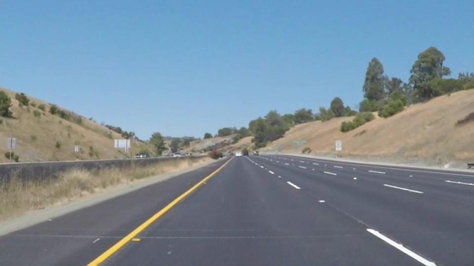
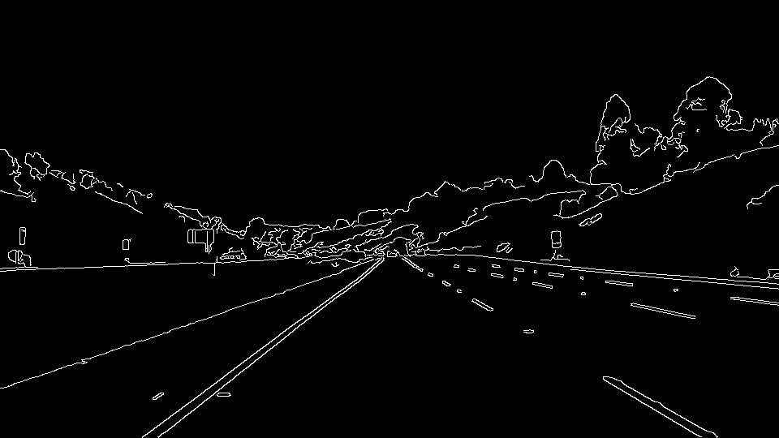

# **Finding Lane Lines on the Road** 

### Pipeline

My pipeline consisted of 7 steps. They are as follows.

#### Step 1 . Reading image

Using matplotlib.image library to read picture from disk, then show it.

#### Step 2. Converting image from rgb to gray

Using grayscale() method to convert image from rgb image to gray image.

#### Step 3. Smoothing image

Using gaussian_blur() method to smooth image and erase some noise.

#### Step 4. Finding edges of image

Using canny() method to find the edges of image.

#### Step 5. Setting ROI of image

Setting a triangle area as the ROI of image by region_of_interest() method.

#### Step 6. Hough Transform and Linear least squares

Using hough transform method to find the lines in image. then, based on the slope of every line to distinguish lines from left line and right line. At last, using numpy polyfit method to get the equation of left line and right line.

#### Step 7. Mixing line result and original image

Using weighted_img() method to mix result and original image.

### Reflection

### 1. Describe your pipeline. As part of the description, explain how you modified the draw_lines() function.

In order to draw a single line on the left and right lanes, I modified the draw_lines() function. 

After hough transform, some line segments and many points will be calculated.

Traversing all the points of line segments to find the maximal value and the minimal value in y axis direction of one image. we call them line_y_max and line_y_min. line_y_max and line_y_min can be regarded as left line and right line's boundary.

Based on the slope of every line segment to distinguish lines from left line and right line and to save left line points and right line points in different list. Using numpy polyfit method to get the equations of left line and right line.

According to line_y_max, line_y_min and two equations, to calculate x value in image.

### 2. Identify potential shortcomings with your current pipeline

One potential shortcoming would fail to detect lines when other car cross line driving.

Another shortcoming is that lighting condition may cause false detection result.

### 3. Suggest possible improvements to your pipeline

A possible improvement would be to try some other edge detection algorithm and find a better way to find the line edge in a image.

Another potential improvement could be to add more restrictive conditions, like slope and length, to filter those line segments.
